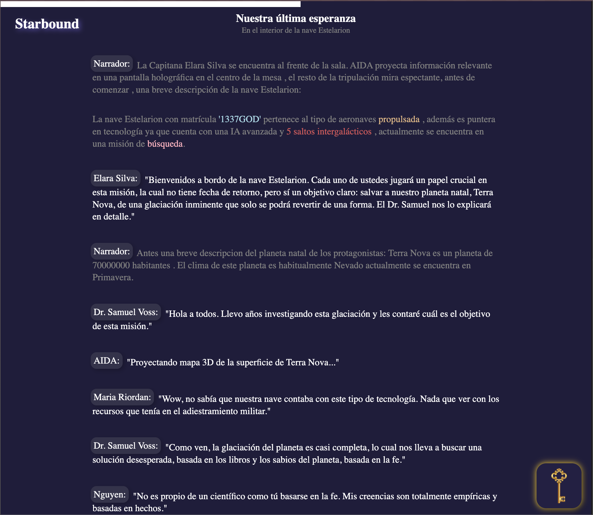

  

<h1>Aventura de Texto Interactiva en JavaScript</h1>
¡Bienvenido a nuestra emocionante Aventura de Texto Interactiva en JavaScript! En este proyecto, te sumergirás en una historia fascinante donde tomarás decisiones importantes que afectarán el desarrollo de la trama.

Descripción
Este proyecto es una aventura de texto basada en consola que te permite experimentar una historia única. Cada escena de la historia te presenta diálogos y decisiones que determinarán el rumbo de la aventura. Tendrás el control total sobre las elecciones que hagas y cómo influirán en el desenlace de la historia.

Funcionalidades Clave
Interfaz de consola fácil de usar.
Historia dividida en escenas con diálogos y descripciones.
Decisiones del usuario que afectan la trama.
Diversas posibilidades y finales de la historia.
Tecnologías Utilizadas
JavaScript
